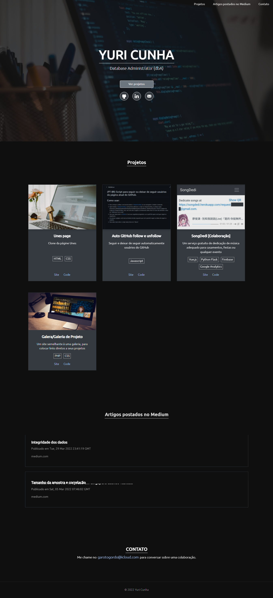

# Portfolio

## Sobre:
<h3> Este site é o meu antigo portfolio. E, você é livre para usa-lo como bem entender, desde que, crie um fork/bifurcação.</h3>
<br>
<br>

# Detalhes
## Veja como ele é:

[Site online](https://projeto-portfolio.garotogordo.codes)


<br>
<br>

# ✨ Getting Started

First, install the modules:
```bash
yarn //recommended
# or
npm install
```

Then, run the development server:
```bash
npm run dev
# or
yarn dev
```

Open [http://localhost:3000](http://localhost:3000) with your browser to see the result.

#

### 💞 Deploying

#### For Netlify(recommended):
- Base directory:
- Build command: ```npm run build``` or ```yarn buid```
- Publish directory: ```./out```
- Environment variables: Set ```NETLIFY_NEXT_PLUGIN_SKIP``` value to ```true``` if you getting errors.

#### For Vercel:
- Build command: ```npm run build``` or ```yarn build```
- Output dir: ```out```
- Install command: ```yarn install```
- Development command: ```nuxt```

#

### 🎄 Learn More

To learn more about Next.js, take a look at the following resources:

-  [Next.js Documentation](https://nextjs.org/docs) - learn about Next.js features and API.
-  [Learn Next.js](https://nextjs.org/learn) - an interactive Next.js tutorial.

You can check out [the Next.js GitHub repository](https://github.com/vercel/next.js/) - your feedback and contributions are welcome!

